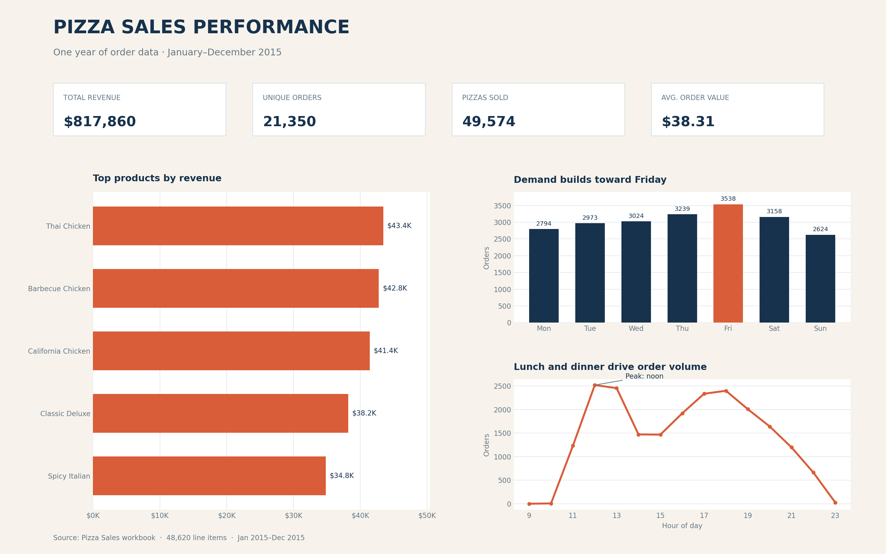
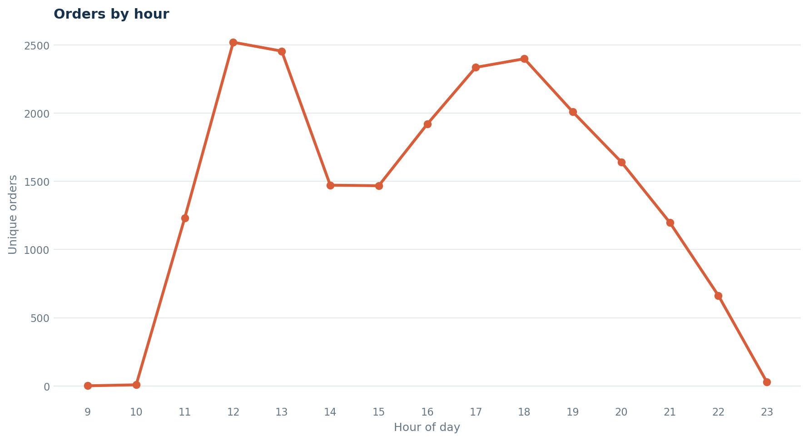
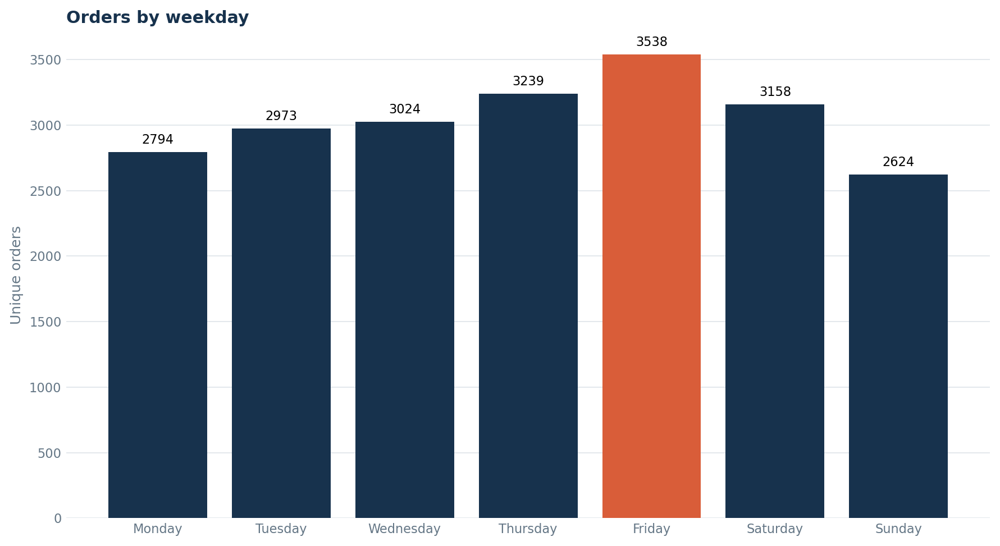
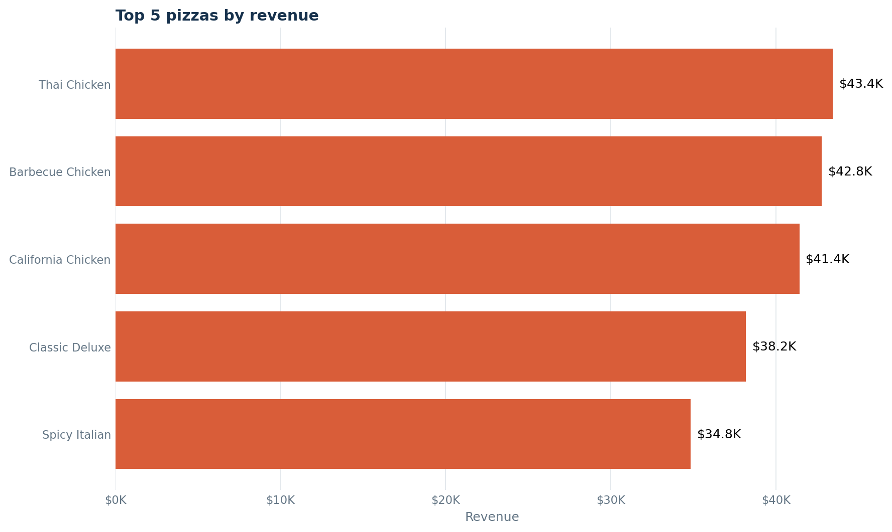
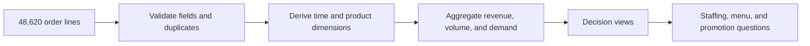

# Pizza Sales Performance Analysis

[](https://www.python.org/)
[](https://pandas.pydata.org/)
[](notebooks/pizza_sales_analysis.ipynb)
[](https://github.com/danieltalbert/pizza-sales-performance-analysis/actions/workflows/analysis.yml)
[](LICENSE)

An exploratory analysis of a full year of pizza-shop transactions. The project turns 48,620 order-line records into a concise view of revenue, product performance, and demand patterns that can support menu and staffing decisions.


_Visual intuition: individual order lines become time, demand, product, and revenue signals. The charts below contain the measured evidence._

## Start here

| If you want to... | Go to |
| --- | --- |
| Read the decision-ready takeaways | [Key findings](#key-findings) |
| Inspect the full dashboard | [Performance dashboard](#performance-dashboard) |
| Compare focused decision views | [Decision views](#decision-views) |
| Reproduce the analysis | [Run locally](#run-locally) |
| Verify source and licensing | [Dataset](#dataset) · [DATASET.md](DATASET.md) |
| Cite or extend the work | [CITATION.cff](CITATION.cff) · [Contributing](CONTRIBUTING.md) |

## Business questions

- How much revenue and order volume did the business generate?
- Which pizzas, categories, and sizes performed best?
- Which weekdays and hours experience the most demand?
- Which products may deserve additional promotion or menu review?

## Key findings

- The shop generated **$817,860.05** from **21,350 orders**, selling **49,574 pizzas** at an average order value of **$38.31**.
- **The Thai Chicken Pizza** led revenue at **$43,434.25**, while **The Classic Deluxe Pizza** led unit volume with **2,453 pizzas sold**.
- **Friday** was the busiest day with **3,538 orders**. Demand concentrated around lunch (**12–1 PM**) and dinner (**5–7 PM**).
- **Classic** was the highest-revenue category at **$220,053.10**, and large pizzas produced **$375,318.70** in revenue.
- **The Brie Carre Pizza** was the lowest-volume product at **490 pizzas sold**, making it a useful candidate for promotion, repositioning, or menu review.

## Performance dashboard



## Decision views

| Staffing by hour | Staffing by day | Product focus |
| --- | --- | --- |
|  |  |  |
| Lunch and dinner peaks suggest when additional coverage matters most. | Weekday comparison turns a calendar pattern into a scheduling input. | Revenue ranking separates commercially important products from unit-volume anecdotes. |

## Repository structure

```text
.
├── data/
│   └── pizza_sales.xlsx              # Source workbook
├── notebooks/
│   └── pizza_sales_analysis.ipynb    # Complete exploratory analysis
├── reports/figures/                  # Dashboard and exported charts
├── src/
│   └── create_dashboard.py           # Reproducible visualization script
├── requirements.txt
└── README.md
```

## Analysis workflow

1. Validate the dataset for missing values and duplicate rows.
2. Combine order dates and times, then derive weekday, hour, and month fields.
3. Calculate headline KPIs and aggregate results by product, category, and size.
4. Compare demand across weekdays and hours.
5. Export focused charts and a one-page dashboard for presentation.



## Run locally

```bash
git clone https://github.com/danieltalbert/pizza-sales-performance-analysis.git
cd pizza-sales-performance-analysis
python -m venv .venv
source .venv/bin/activate
python -m pip install -r requirements.txt
jupyter notebook notebooks/pizza_sales_analysis.ipynb
```

To regenerate the dashboard and supporting figures:

```bash
python src/create_dashboard.py
```

The script accepts alternative inputs and output locations, which CI uses to verify reproducibility without modifying tracked figures:

```bash
python src/create_dashboard.py --data tests/fixtures/pizza_sales_sample.csv --output /tmp/pizza-figures
python -m pytest -q
```

## Dataset

The included workbook covers transactions from January through December 2015. It contains 48,620 order lines and 12 original fields describing order timing, product, quantity, price, size, category, and ingredients. The analysis found no missing values or duplicate rows. Maven Analytics identifies the fictitious dataset as public domain; full provenance, field definitions, and the validation contract are documented in [DATASET.md](DATASET.md).

## Tools

- **Python / pandas** for loading, validation, feature engineering, and aggregation
- **Matplotlib** for reproducible data visualization
- **Jupyter Notebook** for the documented exploratory workflow
- **Excel / openpyxl** for workbook ingestion

## License

Original code and documentation are licensed under the [MIT License](LICENSE). The dataset is public domain and retains the provenance documented in [DATASET.md](DATASET.md).

For help reproducing the analysis, see [SUPPORT.md](SUPPORT.md). Proposed changes
should follow [CONTRIBUTING.md](CONTRIBUTING.md), and sensitive reports should
use the process in [SECURITY.md](SECURITY.md).

